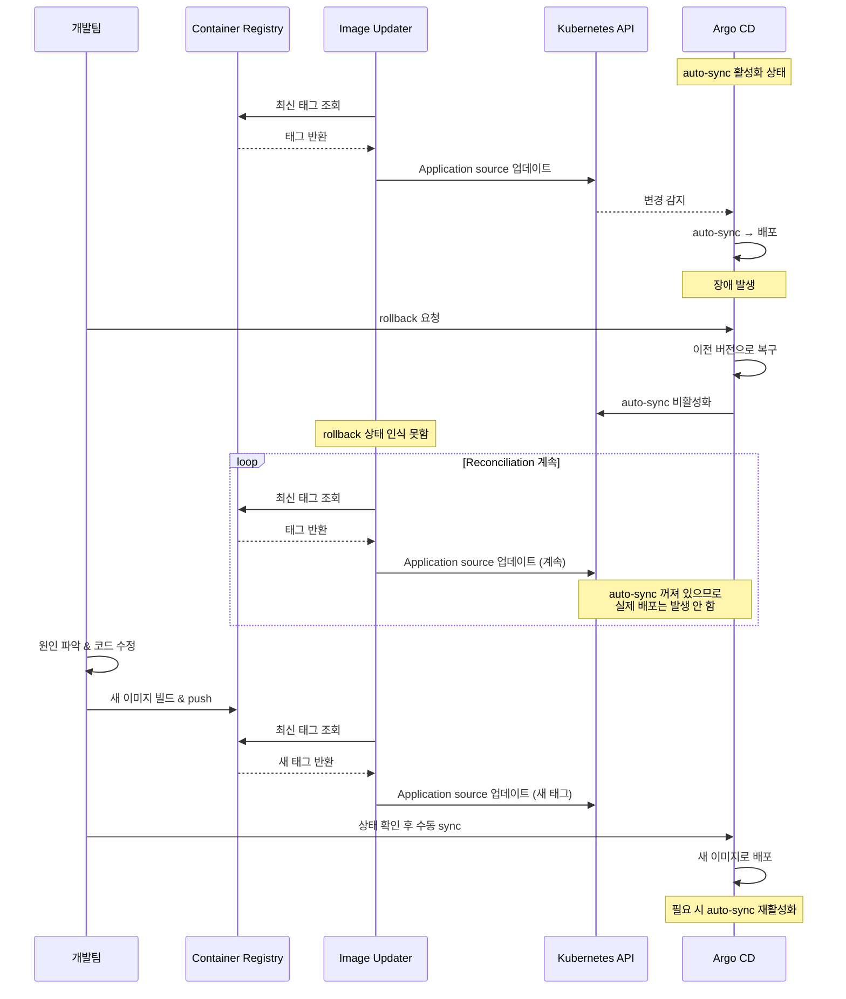

# Argo CD Image Updater - Rollback & Re-deploy Sequence Diagram

## 핵심 포인트

| 상태 | Image Updater | Argo CD |
|------|--------------|---------|
| 정상 운영 | registry 조회 → source 업데이트 | auto-sync → 자동 배포 |
| rollback 직후 | source 업데이트 계속 (rollback 인식 못함) | auto-sync 비활성화 → 실제 배포 안 함 |
| 수정 후 재배포 | 새 태그 감지 → source 업데이트 | 운영자 확인 후 수동 sync |

## 환경별 권장 전략

| 환경 | auto-sync | 이유 |
|------|-----------|------|
| dev / staging | 켜둠 | 빠른 피드백 루프 |
| production | 꺼둠 | rollback 안전성 + 배포 승인 프로세스 |
