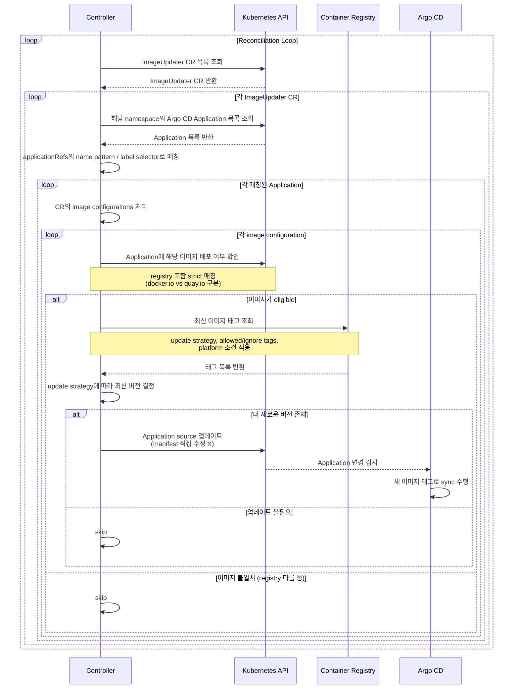

# Argo CD Image Updater - Reconciliation Sequence Diagram

## 주요 흐름 요약

| 단계 | 설명 |
|------|------|
| CR 감시 | Controller가 ImageUpdater CR을 지속적으로 감시 |
| Application 매칭 | name pattern / label selector 기준으로 대상 Application 필터링 |
| 이미지 적합성 검사 | registry까지 포함한 strict 매칭으로 eligible 여부 판단 |
| Registry 조회 | update strategy + 제약 조건 적용해 최신 태그 탐색 |
| Application 업데이트 | manifest 직접 수정 없이 Application source만 변경 → Argo CD에게 위임 |
