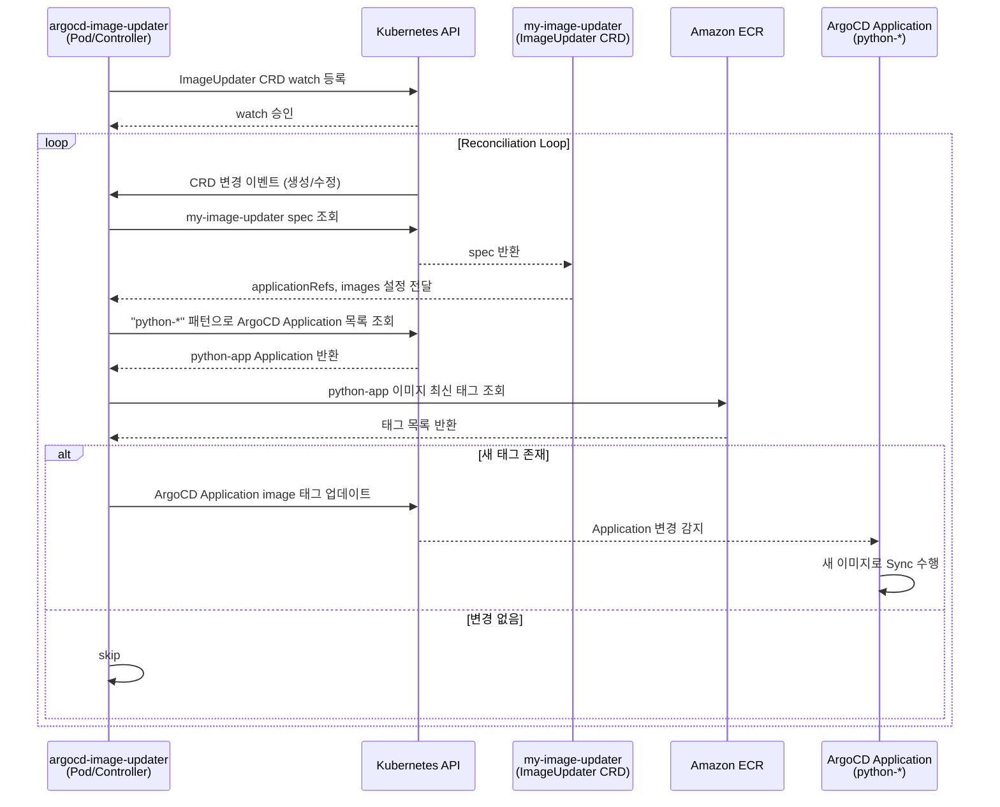

# argocd-image-updater Pod ↔ my-image-updater CRD 관계



## 역할 요약

| 리소스 | 타입 | 역할 |
|--------|------|------|
| `argocd-image-updater` | Pod (Controller) | CRD를 감시하고 실제 업데이트 로직 실행 |
| `my-image-updater` | ImageUpdater CRD | 업데이트 대상 앱/이미지 정책 선언 |
| `python-*` | ArgoCD Application | 실제 이미지 태그가 갱신되는 대상 |

- Pod는 **엔진**, CRD는 **설정**
- Pod가 없으면 CRD는 동작하지 않음
- CRD가 없으면 Pod는 업데이트 대상을 알 수 없음

## Controller의 역할 범위

| 단계 | 수행 주체 |
|------|-----------|
| ECR에서 새 이미지 태그 확인 | Controller(Pod)가 직접 수행 |
| ArgoCD Application의 이미지 태그 갱신 | Controller(Pod)가 수행 |
| 실제 Pod 재생성(이미지 교체) | ArgoCD가 Sync를 통해 수행 |

Controller는 "ArgoCD Application에 선언된 이미지 태그값을 갱신"하는 것까지만 담당하며, 실제 배포(Pod 교체)는 ArgoCD의 Sync 동작이 수행한다.

```
Controller → ECR 확인 → Application 태그 업데이트 → ArgoCD Sync → Pod 교체
```
